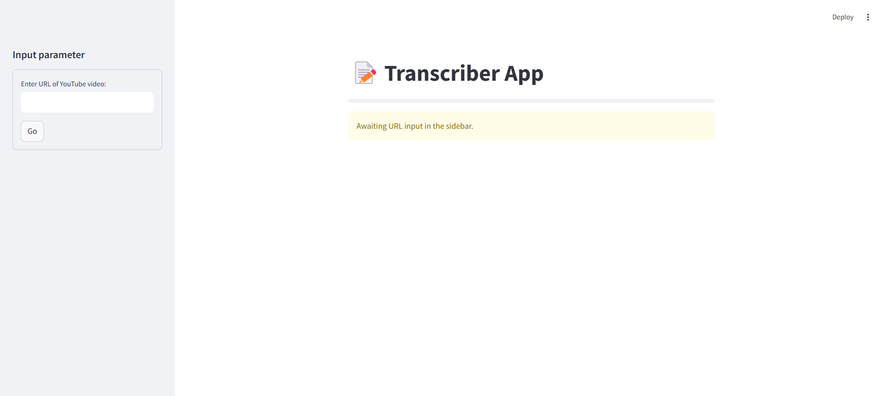

# 🎤 Transcriber App 📝



## 🚀 Overview
The **Transcriber App** is a **Streamlit-based** web application that extracts audio from YouTube videos and converts it into text using **Assembly AI**. The transcribed text can be downloaded in `.txt` or `.srt` format, making it an excellent tool for generating captions and subtitles for YouTube videos. 🎬🎧

## ✨ Features
✅ Extracts audio from YouTube videos using **PytubeFix**.  
✅ Sends audio to **Assembly AI API** for transcription.  
✅ Displays transcribed text on the webpage.  
✅ Supports downloads in **.txt** and **.srt** formats.  
✅ Helps content creators generate captions efficiently and save costs on third-party services.  

## 🔧 Installation
### 📌 Prerequisites
Ensure you have the following installed:
- 🐍 Python 3.8+
- 📦 pip

### 📥 Clone the Repository
```bash
git clone https://github.com/SripalUdyavara/Transcriber-App.git
cd Transcriber-App
```

### 📌 Install Dependencies
```bash
pip install -r requirements.txt
```

## 🎯 Usage
### ▶️ Running the Application
```bash
streamlit run app.py
```

### 📝 How to Use
1. 🔗 Enter the **YouTube video URL** in the input field.
2. 🎬 Click the **Go** button.
3. 🎵 The application will extract audio and send it to Assembly AI for transcription.
4. 📄 The transcribed text will be displayed on the webpage.
5. 📥 Download the transcription in **.txt** or **.srt** format.

## 🔑 API Key Setup
To use **Assembly AI**, set up an API key:
1. 🔑 Sign up at [Assembly AI](https://www.assemblyai.com/).
2. 🛠️ Get your **API key**.
3. 🔧 Add the key to your environment variables or directly in the `config.py` file.

## 📦 Dependencies
- **Streamlit** (🌐 Web UI Framework)
- **PytubeFix** (📥 YouTube Video Audio Extraction)
- **Assembly AI API** (🗣️ Speech-to-Text Transcription)
- **Requests** (🔗 API Calls)

## 🤝 Contributing
Feel free to submit issues or pull requests for improvements! 🚀

## 📜 License
This project is licensed under the **MIT License**. 📝

## 📩 Contact
For any queries, reach out at **📧 SripalUdyavar@gmail.com** or connect on **[LinkedIn](www.linkedin.com/in/sripal-udyavara) 📌**.
